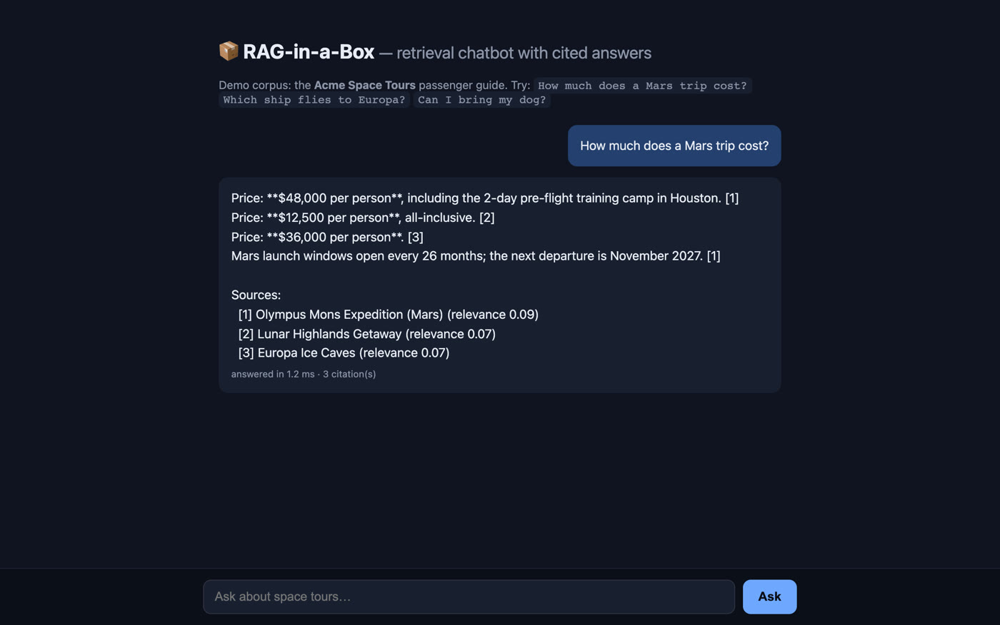

# 📦 RAG-in-a-Box

[](https://github.com/otawfik/rag-in-a-box/actions/workflows/ci.yml)

**[▶ Live demo](https://rag-in-a-box.vercel.app)**

A production-style **retrieval-augmented generation (RAG) chatbot** that runs
entirely on your machine — no API keys, no GPU, no cloud bills. Index your
documents, ask questions in plain English, and get answers with **[n]
citations** pointing back to the exact source sections.

Ships with a fun demo corpus: the *Acme Space Tours* passenger guide
(fictional space-tourism company).



## Features

- **Document chunking engine** — three strategies (`recursive`, `sentence`,
  `fixed`) with configurable size/overlap; markdown-aware section splitting
- **Swappable embedding backends** — TF-IDF + cosine similarity out of the
  box (zero setup); drop in `sentence-transformers` dense embeddings with a
  one-line change
- **Cited answers** — extractive answering composes replies from the most
  relevant sentences and cites every claim as `[1]`, `[2]`, …
- **Web chat UI** (Flask) + **CLI** + **JSON API**
- **Persistent index** — built once, cached to disk, reloaded instantly
- **Test suite** covering chunking, embeddings, retrieval ranking, and the
  full pipeline

## Quickstart

```bash
git clone https://github.com/otawfik/rag-in-a-box.git
cd rag-in-a-box
pip install -r requirements.txt        # Python 3.10+

# Ask from the command line:
python app.py --ask "How much does a Mars trip cost?"

# …or launch the web UI:
python app.py                          # → http://127.0.0.1:5000
```

The first run builds the index from `corpus/` and caches it in
`.ragbox_index/`; later runs load instantly.

## Try these demo questions

| Question | What it shows |
|---|---|
| `How much does a Mars trip cost?` | Exact-fact retrieval with citation |
| `Which ship flies to Europa?` | Multi-hop-ish: destination → fleet section |
| `Can I bring my dog?` | FAQ-style answer (`pets` policy) |
| `How long is the Europa trip?` | Numeric fact extraction |
| `What happens if my flight is scrubbed?` | Policy retrieval |
| `Tell me about quantum teleportation` | Graceful "not in the corpus" fallback |

## How it works

```
corpus/*.md ──▶ chunking ──▶ TF-IDF embed ──▶ VectorStore (cosine search)
                                                        │
user question ──▶ embed ──▶ top-k chunks ──▶ sentence rerank ──▶ cited answer
```

1. **Chunk** — markdown files are split per `##` section, then packed into
   ~600-char overlapping chunks (`ragbox/chunking.py`).
2. **Embed** — chunks become L2-normalized TF-IDF vectors (unigrams +
   bigrams), so dot-product search equals cosine similarity
   (`ragbox/embeddings.py`).
3. **Retrieve** — the query is embedded the same way; the top-k chunks are
   fetched from the in-memory store (`ragbox/store.py`).
4. **Answer** — sentences inside the retrieved chunks are scored by
   retrieval score + query-term overlap; the best ones are composed into an
   answer with `[n]` citations and a Sources list (`ragbox/pipeline.py`).

## Retrieval modes: TF-IDF, dense, hybrid

```python
from ragbox.pipeline import RAGPipeline

pipe = RAGPipeline(retrieval="tfidf")   # sparse lexical match (default, no extra deps)
pipe = RAGPipeline(retrieval="dense")   # sentence-transformers semantic match
pipe = RAGPipeline(retrieval="hybrid")  # both, fused with Reciprocal Rank Fusion
```

`hybrid` keeps one sparse and one dense vector per chunk
(`ragbox/hybrid.py`) and fuses the two rankings at query time. Two fusion
methods are supported via `hybrid_method=`:

- `"rrf"` (default) — Reciprocal Rank Fusion: `score = Σ 1/(k + rank)`.
  Fuses *ranks*, never raw scores, so nothing needs normalizing. Robust
  when the two scorers live on different score scales.
- `"weighted"` — min-max normalize each scorer's scores to [0, 1], then
  `alpha * dense + (1 - alpha) * sparse` (tune with `hybrid_alpha=`).
  One interpretable knob, but the normalization is query-dependent.

Dense mode needs the optional heavy dependency (`pip install
sentence-transformers`, pulls in torch); TF-IDF works without it.

## LLM answer generation (local, grounded, cite-or-refuse)

```bash
pip install transformers  # + torch; ~3GB model download on first use
```

```python
pipe = RAGPipeline(retrieval="hybrid")
ans = pipe.generate("What risks does NVIDIA flag around export controls?")
print(ans.text)      # fluent answer synthesized from the passages
print(ans.refused)   # True when the filings don't contain the answer
print(ans.sources)   # the [n]-numbered passages behind the answer
```

`pipe.generate()` runs a local instruction-tuned model
(Qwen2.5-1.5B-Instruct by default, swap with `llm_model=`) over the retrieved
passages. Three refusal layers:

1. **Retrieval gate** — nothing relevant retrieved, refuse without calling
   the LLM at all.
2. **Relevance judge** — a binary YES/NO call asking whether the passages
   contain the answer; NO refuses. A joint answer-or-refuse prompt makes
   small models refuse everything, so judgment and generation are split.
3. **Empty-output guard** — a blank generation is refused.

Citations are passage-level: the answer is conditioned solely on the cited
passages, and the judge confirmed they contain the answer. (Per-claim `[n]`
markers turned out to be beyond a 1.5B model — seven prompt variants
tested, none reliable — so we don't fake them. Per-sentence provenance is
still available from the extractive `pipe.answer()`.)

Failure modes to know: judge over-refusal, parametric leakage (small models
sometimes answer from their own weights anyway), threshold brittleness in
the retrieval gate, and up to two LLM calls per question (~30-60s on CPU).
See `ragbox/generate.py` for the full discussion.

## SEC EDGAR 10-K ingestion

```bash
export SEC_USER_AGENT="Your Name you@example.com"  # SEC blocks anonymous agents
python -m ragbox.edgar --tickers AAPL MSFT GOOGL NVDA --out corpus/sec10k
```

Downloads each ticker's most recent 10-K from EDGAR, strips markup/scripts and
hidden XBRL payloads, and writes clean text plus a `.meta.json` provenance
sidecar. `ragbox.chunking.load_text` splits filings on their ITEM headers
(ITEM 1, 1A, 7, 8, …) into sections, deduplicating table-of-contents phantom
headers by keeping the longest body per ITEM number.

## Project structure

```
rag-in-a-box/
├── app.py                 # Flask web UI + CLI entrypoint
├── ragbox/
│   ├── chunking.py        # chunking strategies, markdown + 10-K text loading
│   ├── edgar.py           # SEC EDGAR 10-K downloader + HTML cleaner
│   ├── embeddings.py      # swappable Embedder backends (TF-IDF, sBERT)
│   ├── generate.py          # local LLM grounded generation, cite-or-refuse
│   ├── hybrid.py          # hybrid sparse+dense store, RRF / weighted fusion
│   ├── store.py           # vector store, cosine search, persistence
│   └── pipeline.py        # RAGPipeline: index → retrieve → cited answer
├── corpus/
│   ├── acme-space-tours.md  # demo corpus (fictional space tourism guide)
│   └── sec10k/              # real 10-K filings (AAPL, MSFT, GOOGL, NVDA)
├── tests/
│   └── test_ragbox.py     # unittest suite
└── requirements.txt
```

## Tech highlights

- **scikit-learn** `TfidfVectorizer` (sublinear TF, L2 norm) as a zero-dependency
  vector layer; **NumPy** for the similarity math
- Recursive character chunking with sentence-aware packing and overlap
  carry-over — no NLTK/spaCy needed
- Extractive cited-answer generation: every sentence in the reply traces to
  a ranked source chunk
- Clean `Embedder` ABC so sparse → dense upgrades don't ripple through the
  codebase

## Limitations

- TF-IDF is lexical: it won't catch heavy paraphrase ("cheap" vs
  "inexpensive" is fine; "lunar" vs "moon" is borderline). Use the
  `sentence-transformers` backend for semantic matching.
- Answers are extractive, not generative — great for factual QA over your
  docs, not for open-ended writing.

## License

MIT
